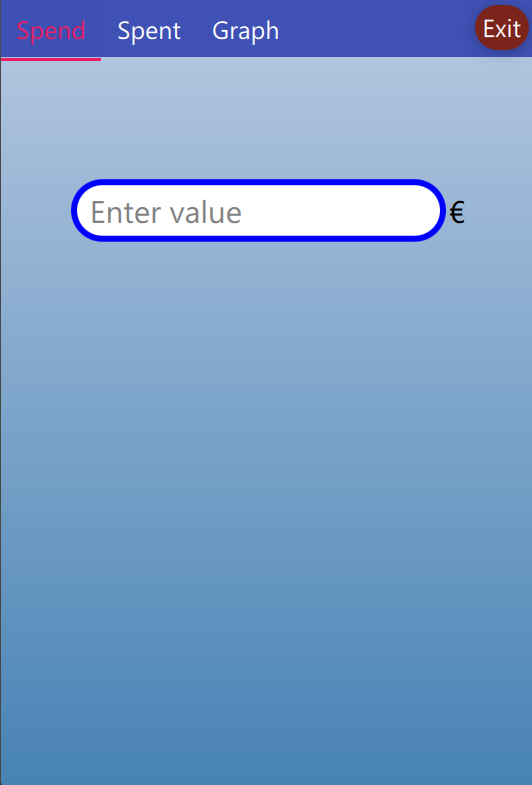

# SeeMoneySpending
This project was created to cater to individuals like my mum who prefer using cash for most of their transactions. The motivation behind this project stemmed from my mum's desire to avoid the guilt associated with seeing unnecessary expenses in a bank app. Additionally, she wanted a simple and user-friendly alternative to the fancy and complicated apps available in the market.

Project Overview

SeeMoneySpending enables users to record their cash transactions, view a list of expenses with dates and amounts, and visualize their yearly spending through a graph. The application's intuitive interface and straightforward features make it ideal for users who prefer simplicity and ease of use.

## Key Features

Expense Tracking: SeeMoneySpending allows users to easily record cash transactions. Users can input the date, amount, and a brief description for each expense, ensuring accurate tracking of spending.

Money Spent Tab: In the Money Spent tab, users can view a comprehensive list of recorded expenses, including the date and amount spent. This feature provides an overview of spending history.

Yearly Spending Graph: SeeMoneySpending offers a graphical representation of yearly spending patterns. The Yearly Spending Graph tab allows users to visualize their expenses by day, helping identify trends and patterns over time.

